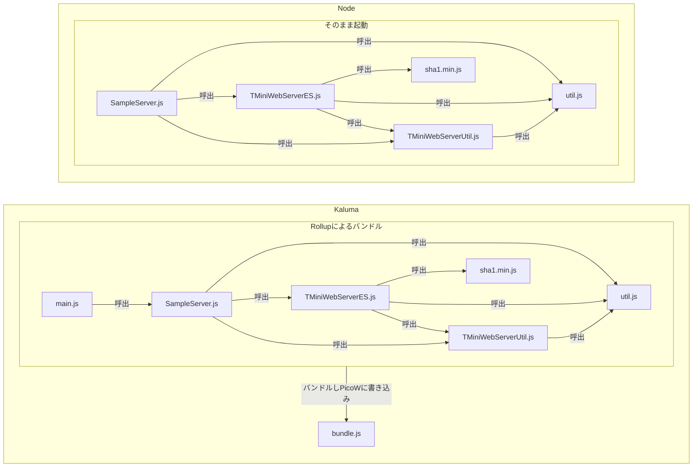

# TMiniWebServerES

Raspberry Pi Pico W 用に作成したコンパクトな WebServer です。
js 基盤（Kaluma 1.2.1）作動します。

## 特徴

- Raspberry Pi Pico W で WebServer 機能を提供
- Flask に似た記述でルーティングを設定
- WebSocket 通信に対応
- ノンブロッキングで並列でリクエストを処理可能

サーバーの定常状態では、およそ 122KB のメモリを使用します。
スレッドは使用しておらず、本ソフトウェアを利用する側へスレッドを使用するかどうかの裁量を残しています。

## 参考

TMiniWebServerES は以下のソフトウェアを参考に実装しました。

- [MicroWebSrv](https://github.com/jczic/MicroWebSrv)
- [microdot](https://github.com/miguelgrinberg/microdot)
- [TMiniWebServer](https://github.com/techmadot/TMiniWebServerv)

# マニュアル

TMiniWebServerES のマニュアルです。
Raspberry Pi Pico2 W でKaluma1.2.1をフラッシュした状態を想定しています。

### ファイル構成

#### Project: TMiniWebServerES

以下はリポジトリのファイル構成ツリーと各ファイル/フォルダの用途概要です。

```
TMiniWebServerES/                      # プロジェクトルート
├─ index.js                             # エントリポイント（Node/ツール用）
├─ wifiTest.js                          # Wi‑Fi 接続のテストスクリプト（Karuma/kaluma 向け）
├─ package.json                         # Node 開発用依存定義（ビルド/ツール設定）
├─ package-lock.json                    # 依存の固定ロックファイル
├─ rollup.config.js                     # フロントエンドバンドル設定（Rollup）
├─ eslint.config.js                     # ESLint 設定ファイル
├─ .prettierrc.yaml                      # Prettier 設定
├─ .gitignore                           # Git 無視設定
├─ LICENSE                              # ライセンス情報
├─ README.md                            # JS 実装の説明（このフォルダ向け）
├─ python/                             # 元のpython実装※参考用に保存
│  ├─ boot.py                              # (MicroPython) 起動時スクリプト／初期化処理
│  ├─ main.py                              # メイン実行スクリプト（Python版の例）
│  ├─ sample_basic.py                      # サンプル：基本的なサーバーの例（Python）
│  ├─ sample_restapi.py                    # サンプル：REST API の実装例（Python）
│  ├─ sample_websocket.py                  # サンプル：WebSocket サーバー例（Python）
│  ├─ Readme.md                            # ルートの README（プロジェクト概要）
│  └─ TMiniWebServer/                      # Python サーバー実装（ライブラリ）
│     ├─ __init__.py                       # パッケージ初期化
│     ├─ tminiwebserver.py                 # サーバー本体の実装（Python）
│     └─ tminiwebserver_util.py            # サーバーのユーティリティ関数（Python）
├─ wwwroot/                             # 静的ウェブコンテンツ
│  ├─ index.html                        # デフォルトの Web UI
│  ├─ Vw.js                             # フロントエンドユーティリティ
│  ├─ ws_test.html                      # WebSocket テストページ
│  ├─ ws_chat.html                      # WebSocket チャットデモ
│  ├─ ws_test.js                        # WebSocket テスト用クライアントスクリプト
│  └─ ws_chat.js                        # チャット用クライアントスクリプト
└─ TMiniWebServerES/                       # JavaScript/ES 実装フォルダ
	├─ main.js                              # JS 実行用エントリ（Karuma/Kaluma 用など）
    ├─ SampleServer.js                      # サンプルサーバー（Node/ES 向け）
    ├─ TMiniWebServerES.js                  # ライブラリ本体（ES モジュール）
	├─ TMiniWebServerUtil.js                # ユーティリティ（ES）
	├─ Utils.js                             # 補助ユーティリティ
	├─ sha1.min.js                          # 署名/ハッシュ用ミニライブラリ
	└─ TMiniWebServerUtil.js                # （重複名確認）ユーティリティ（注意：名前重複あり）
```

注意・補足:

- `wifiTest.js` の最後は `connectWifiStatic;` となっており、関数呼び出しになっていません。実行するには `connectWifiStatic();` に修正してください。
- Karuma/kaluma などの組込み JS 環境では Node の `fs` API と同一ではないことが多く、ファイルアクセスは `storage` や各環境固有 API を使う必要があります。
- `TMiniWebServerES/` 内に `TMiniWebServerUtil.js` が二重に見えるため、実際の用途に応じて整理（重複削除または名前変更）を検討してください。

もしこのツリーに追加の注釈（個別ファイルの詳細な説明や実行方法）を付けたい場合、対象ファイル名と説明したいポイントを教えてください。

## 環境セットアップ

```bash
# ubuntuを想定
$ sudo apt install build-essential node
# パッケージに必要なモジュールを取得（Kaluma環境ではプログラムを１ファイルにする必要が有るため、rollupをバンドラーとして使用しています。)
$ npm install
```

## Kaluma セットアップ

公式サイト
[Kaluma](https://kalumajs.org/)

### Kalumaのインストール

- 公式サイトからPico2 WならPico2 W用のファームウェアの.UF2 fileをダウンロードしてください。
- BOOTSELボタンを押したまま、USBケーブルでPCにつなぎます。
- その後、ボタンから手を放します。そしたら RPI-RP2という名前でUSBストレージとして認識されるはずです。
- そのRPI-RP2ドライブにドラッグアンドドロップでダウンロードしてきたファームウェアの.UF2 fileを置くと自動でインストールされ、再起動します。
    - Ubuntuの場合は管理者権限が要求されます。
- 以上で完了です。違うバージョンに書き換えたい場合も手順は同じで当然、中身は初期化されて消えます。

### 本プロジェクトのセットアップ

一応、以下の手順で動くようになるはずです。kaluma-cliのコマンドは面倒くさいのでnpm scriptでラップしています。

```bash
# ubuntuにnodejsをインストール済みの想定、他の環境は適宜読み替えてください。
# kaluma-cliがいろいろ要求するのでbuild-essentialを入れます。
$ sudo apt install build-essential
$ npm install --save-dev @kaluma/cli

#ディレクトリ作成のためkaluma-cliでkalumaOS上につなぎます。
sudo npx kaluma shell

> .help
> .ls
> .pwd
> .mkdir wwwroot
> .ls

# 続けてWifi設定
> storage.setItem('WIFI_SSID', 'MyHome');
> storage.setItem('WIFI_PASSWORD', '12345678');
> storage.setItem('WIFI_SECURITY', 'WPA2_WPA_PSK');
Ctrl + z でkaluma-cliから抜けます。
```

## サンプルサーバーのビルドと反映

```bash
# ubuntuを想定
$ npm run build
# パッケージに必要なモジュールを取得
$ sudo npm run wwwload # wwwroot配下を反映
$ sudo npm run flash # ビルドしたファイルを反映
```

### wifiでのIPアドレスの確認（DHCPのクライアントとしてのみ作動）

　IPを指定して起動する方法がわからないので現状はDHCPで自動でIPを振られる前提です。

内部で１０回pingをデフォルトゲートウェイに投げてIPアドレスを確認しています。

```bash
#kaluma-cliでkalumaOS上につなぎます。
sudo npx kaluma shell

> .load
# 以下の行が出てきたらIPが取得できています。
#[log] ####1#getConnection ip:192.168.x.y###### undefined

#Kaluma-cliにアクセスが出来ない場合は事前にネットワーク上でPingに応答するIPをすべて洗い出し
$ for a in `seq 1 254`; do ping -c 1 -w 1 192.168.x.$a > /dev/null && arp -a 192.168.x.$a | grep ether; done
# 電源投入後、再度チェックして増えた物が該当のIPの可能性が高いです。
$ for a in `seq 1 254`; do ping -c 1 -w 1 192.168.1.$a > /dev/null && arp -a 192.168.1.$a | grep ether; done
```

参考：LAN内で使用中のIPアドレス(pingで応答があるノード)を簡易に調査するワンライナー(Linux編) https://www.na3.jp/entry/20101231/p1

### サンプルページへのアクセス

プログラムを書き込んだ後、電源投入後にURLにアクセスするとサンプルページが開きます。
（IPアドレスは自分のものを入れてください。）

http://192.168.x.y:8080/index.html

httpsには対応していません。

## 組み込み先のプログラム内でのWebServer 起動

サーバーはロードするプログラム上で以下の記述で起動します。

詳細は`./TMiniWebServerES/SampleServer.js`を参照してください。

```js
import { TMiniWebServerES } from './TMiniWebServerES/tminiwebserver.js';

// Server Start
TMiniWebServerES().start();
```

## スタティックファイルのサービング

TMiniWebServerES のコンストラクターで`wwwroot`の指定が可能です。
ここで指定されたディレクトリからファイルをサービングします。

静的な Web ページを作成した場合には、このディレクトリにファイルを配置してください。

## ルーティングハンドラーの使用

リクエストを処理するハンドラー関数を以下のように実装します。
これは`http://(your-address)/simple`にアクセスにきたときに呼び出されます。

```js
TMiniWebServerES.route('/simple', 'GET', async client => {
	const data = 'Hello,world';

	// ステータスコードは明示的に設定が可能で、省略時にはOK(200)が設定されている.
	//レスポンスヘッダに追加の情報を与えることが可能.
	await client.writeResponse(data, HttpStatusCode.OK, { myheader: 'sample_value' });
});
```

## ルーティングハンドラーとパラメーター受け取り

リクエストを処理するハンドラー関数を以下のように実装します。
このとき、デコレーターによるパス指定で所定の記述をすると、パスの一部をパラメーターとして取得できます。

```js
TMiniWebServerES.route('/sample/<id>/<kind>', async (client, args) => {
	// URL のパスに指定されたパラメータをキーワードで取得.
	const html = `<html lang='ja'>
   <body><p>パラメータ情報: <br/>
   id: ${args['id']}<br/>
   kind: ${args['kind']}</p></body>
   </html>`;
	await client.write_response(html);
});
```

## WebSocket の使用

WebSocket を受け付けるルーティングの設定はデコレーターで行います。
このハンドラー関数は、WebSocket のハンドシェイクが完了後に呼び出されます。
この関数から抜けると、WebSocket 通信はクローズとなります。

```js
TMiniWebServerES.withWS('/ws/', async (websocket, u8a) => {
	try {
		const [data, mimeType] = await websocket.receive(u8a);
		console.log(`received: ${data}/${mimeType}`);
		if (data === 'cmd_close') await websocket.close();
		else await websocket.send('Hello,world!!', TMiniWebSocket.MessageType.TEXT);
	} catch (e) {
		console.error(e);
	}
});
```

この WebSocket 用のハンドラーにおいてもパスのパラメーターを受け取ることが可能です。

```js
TMiniWebServerES.withWS('/ws/<id>', async (websocket, u8a, args) => {
	console.log(args);
	// ...
});
```

## Kaluma のNodejsとの互換性

プロダクト自体はテスト容易性のためKalumaとNodeに対応しています。



### Kaluma のNodejsとの非互換性

別js実装なのでNodejsとは非互換性が有ります。以下分かってる範囲です。ドキュメントが不完全なので他にも有る可能性が高いです。

- console.debug は実装がない
- fsモジュールがNodeと違いコールバックを取らない同期実装になっている

### Node.jsでの実行

```bash
npm run server
```

以下でアクセスできます。

http://localhost:8080/index.html

## Pico が応答不能になった場合

storageが4kbの16スロットしかなく、使い切ると書き込みで応答不能になるため

- https://kalumajs.org/docs/boards/pico2-w

https://www.raspberrypi.com/documentation/microcontrollers/pico-series.html#software-utilities
の
Resetting Flash memory
の項目から flash_nuke.uf2 をダウンロードして
ファイルマネージャからドラッグアンドドロップで反映し

そして最初からやり直すと治ります。

## 免責事項・その他

自由に利用してもらってかまいませんが、使用において発生した如何なる損害について作者は一切の責任を負いません。
各自の責任や判断において使用してください。

ライセンスは MIT としています。
不具合の報告は歓迎ですが、修正の保障はございません。
申し訳ないですが各自での修正作業を行っていただくか、Pull Request を頂ければ嬉しく思います。

WebSocketに必要なSHA-1の実装はCrypto.jsから持ってきています。

```

```
